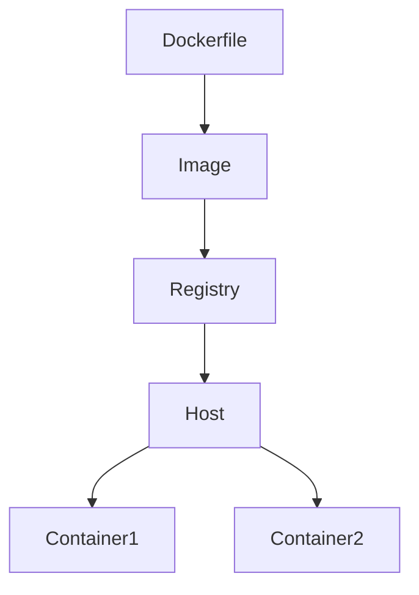

# Overview
Docker packages applications and dependencies into portable containers that can run consistently across developer laptops, CI systems, and production environments.

# Why It Exists
Docker exists to solve environment drift and simplify application packaging, distribution, and runtime isolation.

# Architecture


# Core Concepts
- images and layers
- containers
- registries
- networks
- volumes

# Installation
Install Docker Engine or Docker Desktop depending on the host type. In servers, prefer engine-only installs with controlled daemon configuration.

# Configuration
Configure the daemon, registry mirrors, storage driver, logging driver, resource limits, and network settings.

# Components
- Docker daemon
- CLI
- image cache
- registry
- runtime

# Workflow
Build an image, scan it, push it to a registry, deploy containers, monitor health, and rotate old artifacts.

# Production Use Cases
- microservice packaging
- CI build environments
- local parity for developers
- sidecar or utility containers

# Best Practices
- Use minimal base images
- Pin versions
- Scan images
- Avoid running as root
- Separate build and runtime layers

# Security
Use signed or trusted images, minimize privileges, keep secrets outside images, and patch base images regularly.

# Monitoring
Track container restarts, image pull failures, disk usage, daemon health, and runtime resource limits.

# Troubleshooting
Inspect logs, check image tags, confirm port mappings, review volume mounts, and validate entrypoint behavior.

# Common Errors
| Error | Meaning | Typical Fix |
| --- | --- | --- |
| ImagePullBackOff | Registry or image tag issue | Verify image name, auth, and network |
| Port already allocated | Port conflict on host | Change mappings or stop conflicting service |
| Container exits immediately | Entrypoint failed | Inspect startup logs and command syntax |

# Commands
```dockerfile
FROM python:3.12-slim
WORKDIR /app
COPY . .
RUN pip install -r requirements.txt
CMD ["python", "app.py"]
```

```bash
docker build -t demo-app:1.0 .
docker run -d -p 8080:8080 demo-app:1.0
docker logs -f <container-id>
docker system df
```

# Interview Questions
1. What is the difference between an image and a container?
2. Why should production containers avoid running as root?
3. How do layers affect build performance?

# References
- Docker Docs
- container image hardening guides
- runtime security recommendations
