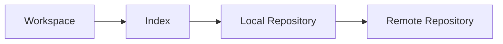

# Overview
Git is a distributed version control system used to track code, infrastructure, documentation, and operational changes with history and collaboration workflows.

# Why It Exists
Git exists to make change tracking, branching, rollback, and collaboration reliable across teams and repositories.

# Architecture


# Core Concepts
- commits
- branches
- tags
- merges and rebases
- working tree and staging area

# Installation
Install Git from the platform package manager and configure user identity, credential handling, and signing policy.

# Configuration
Set `user.name`, `user.email`, pull strategy, line-ending behavior, aliases, and SSH credentials.

# Components
- working directory
- index
- local object database
- remote repositories

# Workflow
Create or update files, stage changes, commit with context, push to remote, open review, merge, and tag releases where needed.

# Production Use Cases
- IaC versioning
- pipeline definitions
- release branching
- incident fix tracking
- configuration history

# Best Practices
- Keep commits focused
- Protect main branches
- Use pull requests
- Tag release points
- Review infrastructure changes carefully

# Security
Use signed commits where required, protect secrets with scanning, restrict repository permissions, and avoid committing plaintext credentials.

# Monitoring
Audit branch protections, merge activity, secret scanning alerts, and repository access logs in the hosting platform.

# Troubleshooting
Use `git status`, `git log`, `git diff`, and `git reflog` to recover history and understand branch state.

# Common Errors
| Error | Meaning | Typical Fix |
| --- | --- | --- |
| Non-fast-forward push rejected | Remote branch moved ahead | Pull or rebase before pushing |
| Merge conflict | Same lines changed differently | Resolve file conflicts and recommit |
| Detached HEAD | Not on a branch tip | Create or checkout a branch |

# Commands
```bash
git status
git log --oneline --graph --decorate -10
git checkout -b feature/platform-hardening
git rebase origin/main
git reflog
```

# Interview Questions
1. What is the difference between merge and rebase?
2. How does Git store history internally?
3. How would you recover a commit that appears lost?

# References
- Git documentation
- internal branching strategy guides
- repository governance standards
