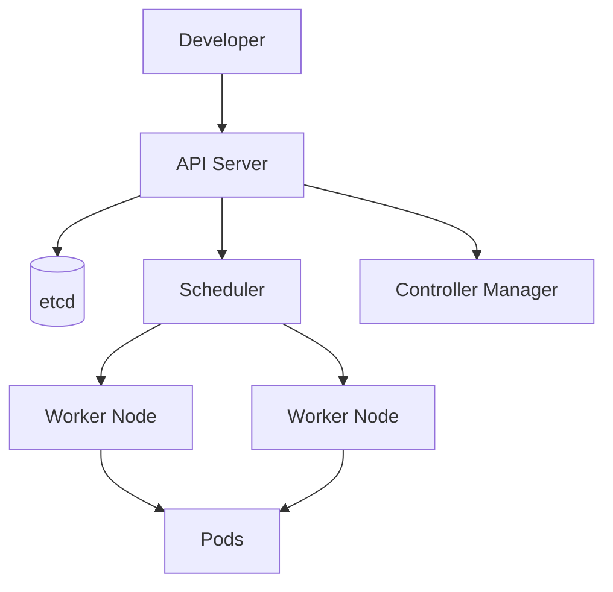

# Overview
Kubernetes orchestrates containers across clusters, providing declarative deployment, service discovery, autoscaling, resilience, and policy-driven operations.

# Why It Exists
It exists to manage containerized workloads at scale without forcing operators to treat each host as a manual snowflake.

# Architecture


# Core Concepts
- pods
- deployments
- services
- ingress
- control plane and worker nodes

# Installation
Use managed offerings such as AKS or EKS for most teams. For self-managed clusters, automate node bootstrap, networking, certificates, and add-ons.

# Configuration
Define cluster networking, RBAC, admission policies, storage classes, ingress controllers, autoscaling, and observability integrations.

# Components
- API server
- etcd
- scheduler
- controller manager
- kubelet and kube-proxy

# Workflow
Teams apply manifests, Kubernetes reconciles desired state, schedulers place workloads, services expose endpoints, and controllers maintain health.

# Production Use Cases
- microservices platforms
- internal developer platforms
- batch and cron jobs
- ingress consolidation
- multi-tenant environments

# Best Practices
- Use namespaces and quotas
- Standardize labels and probes
- Enforce RBAC
- Store manifests in Git
- Define resource requests and limits

# Security
Use least-privilege service accounts, network policies, image scanning, secret management integrations, and policy enforcement.

# Monitoring
Observe API latency, pod restarts, node pressure, scheduling failures, control plane health, and workload SLO indicators.

# Troubleshooting
Inspect events, pod descriptions, logs, readiness probes, resource limits, and network policies. Start from the control plane event trail before changing manifests.

# Common Errors
| Error | Meaning | Typical Fix |
| --- | --- | --- |
| CrashLoopBackOff | Application exits repeatedly | Inspect logs, config, or dependency failures |
| Pending pod | No suitable node or resource | Check taints, selectors, and cluster capacity |
| 503 through ingress | Backend not healthy | Verify service endpoints and pod readiness |

# Commands
```yaml
apiVersion: apps/v1
kind: Deployment
metadata:
  name: api
spec:
  replicas: 3
  selector:
    matchLabels:
      app: api
  template:
    metadata:
      labels:
        app: api
    spec:
      containers:
        - name: api
          image: demo/api:1.0.0
          ports:
            - containerPort: 8080
```

```bash
kubectl get pods -A
kubectl describe pod api-1234
kubectl logs deploy/api --tail=100
kubectl get events --sort-by=.lastTimestamp
```

# Interview Questions
1. What happens from `kubectl apply` to a running pod?
2. How do readiness and liveness probes differ?
3. What would you inspect when pods remain in `Pending`?

# References
- Kubernetes documentation
- cluster operations runbooks
- cloud provider Kubernetes best practices
