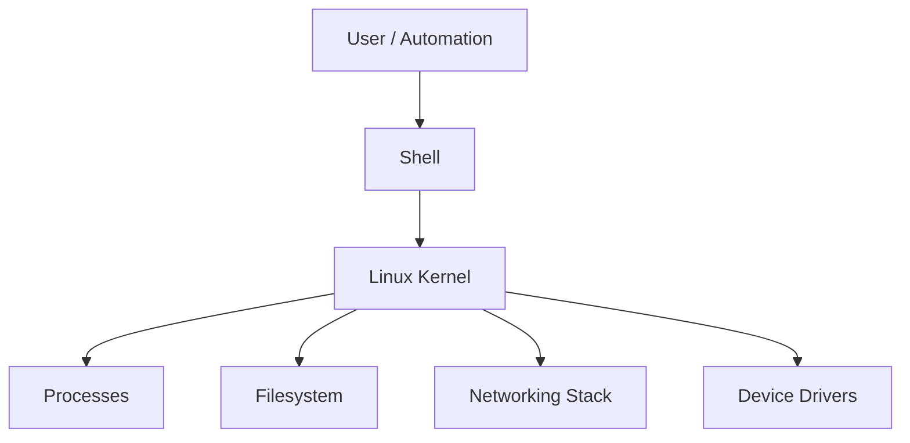

# Overview
Linux is the operational foundation for servers, containers, and automation platforms. It provides the process model, networking stack, filesystem controls, and command-line tooling that DevOps teams rely on every day.

# Why It Exists
Linux exists to offer a portable, multi-user, secure operating system that can run from embedded devices to large-scale cloud platforms.

# Architecture


# Core Concepts
- Kernel and user space
- Processes, threads, and signals
- Filesystems and permissions
- Package managers and services
- Logs, sockets, and scheduling

# Installation
Choose a distribution such as Ubuntu, RHEL, Debian, or Rocky Linux. For cloud systems, standardize a hardened base image and automate package setup with cloud-init or configuration management.

# Configuration
Key areas include user access, SSH hardening, package repositories, systemd services, hostname resolution, time synchronization, and log rotation.

# Components
- `systemd`
- `sshd`
- package manager
- `/proc` and `/sys`
- shell utilities such as `grep`, `awk`, `sed`, and `journalctl`

# Workflow
Provision the host, patch the OS, apply baseline security, install runtime dependencies, configure services, monitor the node, and document operational runbooks.

# Production Use Cases
- Kubernetes worker nodes
- CI/CD runners
- Build servers
- Bastion hosts
- Monitoring and logging agents

# Best Practices
- Use least privilege and sudo-based access
- Patch regularly
- Standardize images
- Automate validation checks
- Separate application and system logs

# Security
Disable password SSH where possible, enforce key rotation, restrict inbound ports, audit privileged activity, and use file integrity monitoring for critical systems.

# Monitoring
Track CPU, memory, disk, inode use, service health, login failures, and kernel messages. Export host metrics with Node Exporter or cloud-native agents.

# Troubleshooting
Use `top`, `ps`, `ss`, `journalctl`, `dmesg`, `df`, `du`, and `systemctl status` to isolate resource pressure, service failures, or network issues.

# Common Errors
| Error | Meaning | Typical Fix |
| --- | --- | --- |
| Permission denied | File or command access is blocked | Verify ownership, mode bits, and sudo policy |
| No space left on device | Disk or inode exhaustion | Clear old logs, resize storage, or rotate artifacts |
| Unit failed | Systemd service did not start | Review `journalctl -u` output and dependency order |

# Commands
```bash
uname -a
systemctl status nginx
journalctl -u docker --since "1 hour ago"
ss -tulpn
find /var/log -type f -mtime +7
```

# Interview Questions
1. What is the difference between a process and a thread in Linux?
2. How does `systemd` improve service lifecycle management?
3. What steps would you take when a Linux server becomes unreachable?

# References
- Linux man pages
- distribution hardening guides
- SRE runbooks for host operations
