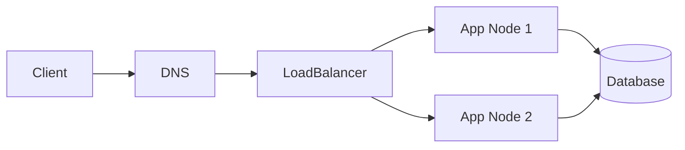

# Overview
Networking connects services, users, and infrastructure across hosts, clusters, and cloud platforms. For DevOps, it is central to routing, service discovery, security, and incident troubleshooting.

# Why It Exists
Networking exists to move data reliably between systems while enforcing isolation, addressability, and transport guarantees.

# Architecture


# Core Concepts
- IP addressing and subnetting
- DNS and service discovery
- TCP, UDP, TLS
- Routing and NAT
- Firewalls, proxies, and load balancers

# Installation
In most environments the stack ships with the operating system, but network tooling such as `tcpdump`, `dig`, and `traceroute` should be included in baseline images.

# Configuration
Configure DNS resolvers, routes, firewall policies, load balancer listeners, TLS certificates, and cloud network security groups.

# Components
- NICs and virtual interfaces
- route tables
- DNS servers
- reverse proxies
- firewalls and security groups

# Workflow
Traffic resolves DNS, reaches an ingress point, passes through routing and security controls, and is forwarded to backend services.

# Production Use Cases
- Kubernetes ingress
- VPC and VNet design
- Private service endpoints
- Hybrid connectivity
- Zero-downtime cutovers

# Best Practices
- Keep IP plans documented
- Standardize DNS naming
- Use TLS everywhere
- Separate public and private tiers
- Monitor latency and packet drops

# Security
Use least-open firewall rules, private networking for internal systems, DDoS protections, certificate rotation, and segmented environments.

# Monitoring
Track latency, throughput, retransmits, DNS response times, LB health checks, and connection error rates.

# Troubleshooting
Check DNS first, then routing, firewall rules, listener configuration, certificate validity, and backend health.

# Common Errors
| Error | Meaning | Typical Fix |
| --- | --- | --- |
| Connection refused | Port is closed or app not listening | Validate service status and listener port |
| Timeout | Packet dropped or route broken | Inspect firewall rules and network path |
| NXDOMAIN | DNS record missing | Correct zone entries or resolver settings |

# Commands
```bash
dig api.example.com
nslookup kubernetes.default.svc.cluster.local
curl -vk https://service.example.com
tcpdump -i eth0 port 443
traceroute 10.0.2.15
```

# Interview Questions
1. What is the difference between TCP and UDP?
2. How would you debug intermittent DNS failures?
3. Why are load balancers critical in highly available systems?

# References
- RFC documentation
- cloud networking architecture guides
- Kubernetes service networking references
