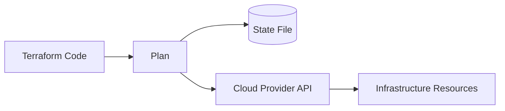

# Overview
Terraform is an infrastructure as code tool that describes cloud and platform resources declaratively and applies them through providers.

# Why It Exists
Terraform exists to make infrastructure repeatable, reviewable, and version-controlled across environments.

# Architecture


# Core Concepts
- providers
- resources
- modules
- state
- plan and apply lifecycle

# Installation
Install the CLI on local machines and automation runners, then version-pin Terraform and provider plugins.

# Configuration
Set backend state storage, locking, workspace or folder strategy, variable sources, and policy validation steps.

# Components
- root module
- child modules
- backend
- state file
- provider plugins

# Workflow
Write code, run formatting and validation, review a plan, apply through automation, and manage state carefully.

# Production Use Cases
- VPC and VNet provisioning
- Kubernetes clusters
- IAM and RBAC scaffolding
- DNS and ingress infrastructure
- shared platform modules

# Best Practices
- Use remote state with locking
- Keep modules composable
- Separate environments cleanly
- Review plans in CI
- Avoid manual state edits unless necessary

# Security
Protect state files, keep secrets out of plaintext variables, use least-privilege cloud roles, and scan code for risky changes.

# Monitoring
Track apply failures, drift signals, backend lock contention, and module version adoption.

# Troubleshooting
Review plan output carefully, inspect state references, confirm provider credentials, and compare actual resource configuration with code intent.

# Common Errors
| Error | Meaning | Typical Fix |
| --- | --- | --- |
| State lock held | Another run owns the lock | Wait or unlock only after verification |
| Provider auth failure | Credential or role issue | Recheck auth chain and scopes |
| Resource already exists | Drift or import needed | Import resource or rename object |

# Commands
```terraform
resource "aws_s3_bucket" "state" {
  bucket = "devops-playbook-state"
}
```

```bash
terraform fmt -recursive
terraform init
terraform plan -out=tfplan
terraform apply tfplan
terraform state list
```

# Interview Questions
1. Why is remote state important in team environments?
2. How do modules improve Terraform maintainability?
3. What is the difference between `terraform plan` and drift detection?

# References
- Terraform documentation
- provider best practices
- IaC governance standards
